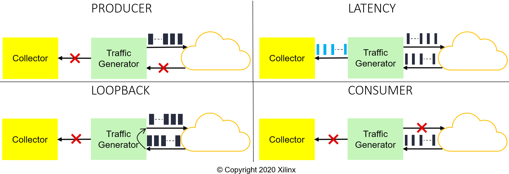

# Benchmark kernel

This folder contains the source code to generate the benchmark application, which is a mix of RTL and HLS kernels.

This application is actually split into two independent kernels, [traffic generator](#traffic-generator) and [collector](#collector) 

## Modes

First let's see what the benchmark application is capable of. The following figure shows a representation of the four modes available on the benchmark kernel.



* Mode 0, `PRODUCER`. Generates payload with a specif *dest* and size, multiple of 64-Byte up to 1472-Byte, the minimum size is 64-Byte. Only transmitting AXI4-Stream is enabled.

* Mode 1, `LATENCY`. Generates an 18-Byte payload, it also consume incoming payload (which are reflected from other endpoint) and generate a summary of it that is populated to the collector. All three AXI4-Stream are enabled. 

* Mode 2, `LOOPBACK`. The receiving payload is forwarded, the *dest* can be updated in the transmitter side. Both transmitting and receiving AXI4-Stream are enabled.

* Mode 3, `CONSUMER`. Consume incoming packets and do nothing else. Only receiving AXI4-Stream is enabled.

## Traffic Generator

The traffic generator kernel is an RTL kernel, and it not only in charge of generating payload, but also consuming payload and generating a summary of incoming payload.
The functionality depends on the mode.


### Payload generator

The main FSM is in charge of generating the data that will be use as payload in the UDP packets, each payload packet has the following header. 

```C
struct payload_header {
  bit[ 39:  0]  packet_id;
  bit[ 79: 40]  local_timestamp;
  bit[119: 80]  total_number_packets;
}
```

This header is useful when measuring latency. There is a secondary FSM, which depending on the mode will generate a summary that it is populated to the collector. The summary stream has the following structure.

```C
struct summary_struct {
  bit[ 39:  0]  packet_id;
  bit[ 79: 40]  tx_local_timestamp;
  bit[119: 80]  rx_local_timestamp;
}
```

This secondary FSM will assert `tlast` in the summary stream either when the experiment ends, last payload packet was received or when a timeout is reached. 

### Register map

|Offset |          Name         | Mode | Description |
|-------|-----------------------|------|-------------|
| 0x00  | crtl\_signals         | R/W  | Kernel control signals, more info [here](https://www.xilinx.com/html_docs/xilinx2020_1/vitis_doc/devrtlkernel.html#xvi1504034323705) |
| 0x10  | mode                  | R/W  | Mode selector |
| 0x14  | outbound\_dest        | R/W  | Set outbound `TDEST` |
| 0x18  | num\_packets\_lsb     | R/W  | Number of packets LSB |
| 0x1C  | num\_packets\_msb     | R/W  | Number of packets MSB |
| 0x20  | num\_beats            | R/W  | Number of transactions per piece of payload, the size the payload will be num\_beats * 64-Byte. Max is 23 |
| 0x24  | tbwp                  | R/W  | Clock ticks between two consecutive payload packets |
| 0x28  | reset\_fsm            | W    | Reset internal FSMs, self clear  |
| 0x2C  | fsm\_debug\_info      | R    | Internal FSM state  |
| 0x30  | reserved              | -    | Reserved for future use  |
| 0x34  | out\_traffic\_cycles  | R    | Outbound traffic, number of cycles (64-bit)  |
| 0x3C  | out\_traffic\_bytes   | R    | Outbound traffic, number of bytes (64-bit)  |
| 0x44  | out\_traffic\_packets | R    | Outbound traffic, number of payload packets (64-bit)  |
| 0x4C  | in\_traffic\_cycles   | R    | Inbound traffic, number of cycles (64-bit)  |
| 0x54  | in\_traffic\_bytes    | R    | Inbound traffic, number of bytes (64-bit)  |
| 0x5C  | in\_traffic\_packets  | R    | Inbound traffic, number of payload packets (64-bit)  |
| 0x64  | summary\_cycles       | R    | Summary traffic, number of cycles (64-bit)  |
| 0x6C  | summary\_bytes        | R    | Summary traffic, number of bytes (64-bit)  |
| 0x74  | summary\_packets      | R    | Summary traffic, number of payload packets (64-bit)  |
| 0x7C  | debug\_reset          | W    | Reset debug probes, self clear  |


## Collector

The [collector](src/collector.cpp) is an HLS kernel. It should only be enabled when measuring latency. This kernels reads the summary generated by the *payload generator* and performs the following operation for each incoming packet `rx_local_timestamp - tx_local_timestamp`, this result is the Round-Trip Time (RTT) for an individual packet (in clock cycles) and it is represented using 32-bit. The RTT result (32-bit value) for each packet is written to a local memory, in order to maximize throughput with global memory, 16 elements are arranged in a 512-bit vector. Once the local memory is full the results are copied to global memory, again this is done to maximize performance with global memory. The local memory is 512-bit width and 64 rows depth, so I can hold up to 1,024 RTT results. 

When `tlast` is asserted this kernel finishes and moves the local memory to global memory. The total number of received packets can be read from the `received_packets` argument.

From Software, users should retrieve the results from global memory and multiply each individual result by the clock period in order to convert the RTT measurement to seconds. Statistics such as arithmetic mean, max, min standard deviation can also be computed. The companion notebooks shows how to do this.

> Note: The clock frequency can vary between implementations and even at runtime. For this reason the conversion from clock cycles to seconds is perform in software.

---------------------------------------
<center> Copyright&copy; 2020-2021 Xilinx </center>